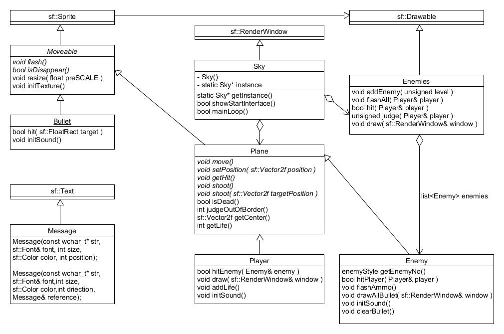

    <h1>实验报告</h1>
    郑雷 
    2014060101028

##需求

###目标用户

1. 无聊的时候自己玩
2. 分享给大家刷分玩
3. 给家里小朋友玩(类似4399）

###游戏规则

* 玩家有3条命，被一发子弹命中之后会减一条命
* 玩家用鼠标控制英雄飞机移动，单击鼠标左键射击  
* 敌机从地图顶端出现，分两种敌机：敌机1 和 敌机2
* 敌机1只有一条命，飞行较慢且只竖直向下飞行，子弹方向竖直向下
* 敌机2有两条命，飞行速度较快且沿斜线飞行（撞到墙壁会反弹），开火方向朝向玩家当前位置（但不会跟踪），子弹速度较快
* 击毁敌机1得1分，击毁敌机2得10分
* 玩家每得20分升一级，级数越高，难度越大（是的(´･_･`)，玩家本身能力无提升）

##实现

###工具&环境

* windows7 & ubuntu14.04LTS
* CodeBlocks13.12 with gcc4.7.1
* SFML2.3

###SFML的配置

####Windows下：

在这里偷懒直接引用我给组员写的教程：

>在官网下载对应版本的SFML（MinGW版本在<CodeBlocks安装目录>\MinGW\Readme*.txt可以看到），解压，别忘记把<SFML安装目录>\bin添加到环境变量（不会的可以搜索一下）

>创建“Empty project”

>菜单栏“工程”-》“属性”-》"构建目标"选项卡，在“类型：”下拉列表选择"GUI application"

>右键“Management”框内的工程名（如：HitPlane）->“构建选项”：
>先在左边框内点击工程名->“搜索目录”选项卡:  
>在“编译”选项卡下添加<你安装的SFML目录位置>\include  
>在“连接器”选项卡下添加<你安装的SFML目录位置>\lib  

>然后再点右边框内点击Release->连接器设置，依次序（！）添加："sfml-graphics.a", "sfml-window.a"和"sfml-system.a"三个文件
>然后再点右边框内点击Debug->连接器设置，依次序（！）添加："sfml-graphics-d.a", "sfml-window-d.a"和"sfml-system-d.a"三个文件

>/*  
>\*以上使用动态链接版本的SFML，  
>\*如需使用静态连接版本，请将原来的\*\*\*.a和\*\*\*-d.a文件换成\*\*\*-s.a
>\*\*\*\*-s-d.s文件  
>\*再点左框内工程名，右边“编译器设置”->“#defines”  
>\*在下面的文本框中写入“SFML_STATIC”(不包含引号）  
>\*/

####Ubuntu下：

直接 `sudo apt-get install libsfml-dev` 然后在CodeBlocks链接选项里加上 `-lsfml-graphics -lsfml-window -lsfml-system`即可

###UML图

###关键实现代码

####src/SKy.cpp:

    srand( (unsigned)time(NULL) );
    this->setMouseCursorVisible( false );
    musicBGM.play();

    //Main loop
    while (this->isOpen()) {

        sf::Event event;
        while (this->pollEvent(event)) {
            //Close window when exit
            if (event.type == sf::Event::Closed) {
                this->close();
            }
            //Close window when esc is pressed
            if ( event.type == sf::Event::KeyPressed &&
                 event.key.code == sf::Keyboard::Escape ) {
                this->close();
            }

            //Auto resize
            if ( event.type == sf::Event::Resized ) {
                this->resize( event.size.width, event.size.height );
            }

            if ( event.type == sf::Event::KeyPressed &&
                 event.key.code == sf::Keyboard::Comma ) {
                player.addLife();
            }

            if( event.type == sf::Event::KeyPressed &&
                event.key.code == sf::Keyboard::P ) {
                    this->pause( enemies, player );
                }
        }

       //Add enemy if it is the right time
        enemies.addEnemy( level );

        //flash all enemies and theirs bullets
        enemies.flashAll( player );

        //Move player
        sf::Vector2i mousePosition = sf::Mouse::getPosition(*this);
        player.setPosition( sf::Vector2f( mousePosition.x / nowSCALE - 48, mousePosition.y / nowSCALE - 64) * SCALE );

        //Player shoot
        if ( sf::Mouse::isButtonPressed(sf::Mouse::Left) ) {
            player.shoot();
        }

        //Flash all player bullet and player itself
        player.flash();

        //Judge if enemies hitted by player's bullet
        score += enemies.judge( player );

        //Weather player get hit
        if( enemies.hit( player ) ) {
            player.getHit();
        }

        this->clear();

        this->drawGameInterface( enemies, player );

        this->display();

        if( player.isDisappear() ) break;

        shootCounter++;
    }
    
    //Dead:
    musicBGM.stop();
    this->setMouseCursorVisible( true );
    return this->showGameOverInterface( enemies, player );

完整代码请见[我的GitHub](https://github.com/starsharp06sharp)  

###封装方法

由于运行游戏游戏所需要的文件较多，所以使用了Windows自带的iexpress.exe进行封装（顺变一提，封装出来的.exe竟然可以在Ubuntu的wine下正常运行！）我的GitHub也提供了写好的[.SED配置文件](https://github.com/starsharp06sharp/HitPlane/tree/PublishVersion/Package)可供直接导入iexpress

##测试&总结

###测试平台

####测试机1：

* CPU：Intel 赛扬E1400
* RAM：1GB
* 显卡：Intel GMA950
* 系统：WindowsXP

####测试机2

* CPU：Intel 酷睿i5-4200U
* RAM：4GB
* 显卡：Inel HD4400
* 系统：Windows7(x64) & Ubuntu14.04LTS(x64)

###测试结果

在测试机1和测试机2的windows系统上均流畅，但在Ubuntu系统下编译的游戏出现了鼠标不灵敏的问题，经过打log分析确认是`sf::Mouse::getPosition()`函数的锅，目前暂时使用windows下的.exe和wine代替

###总结与心得

第一次使用第三方图形库做开发，也第一次真正体会到面向对象编程的魅力，将游戏中的物体抽象成具有继承关系的类竟然如此的自然，让我对不同的编程思想和编程风格有个一个了解，真正对编程做到了入门

当然，如果作为一个实用的程序来看待的话，这个小游戏还有很多不足，将来我还会不定期继续维护这个游戏，继续添加新的功能，使其能真正上得了台面